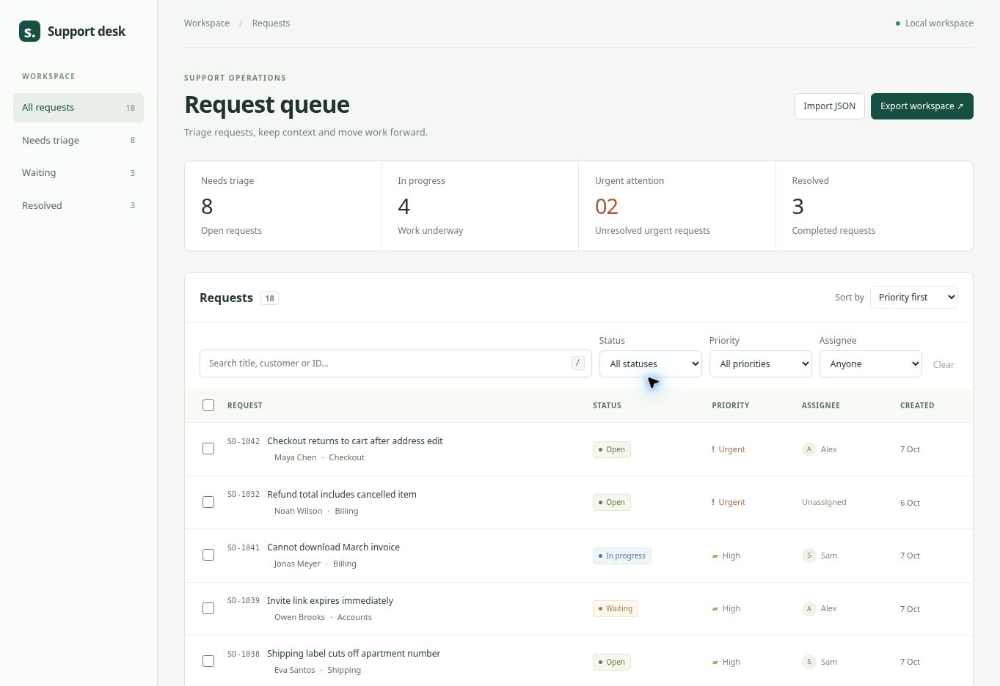

# Support Desk Workbench

A React and TypeScript interface for triaging support requests. Open a request, update its status or owner, add context, and continue later without losing local changes.

This is an independent portfolio project with fictional customers. It is not client work and does not connect to a support provider.

[Open the live demo](https://flankero-dev.github.io/support-desk-workbench/)



## Try the workflow

1. Search for **Maya**, then open the matching checkout request.
2. Change its status and add an internal note. Close the dialog with Escape.
3. Reload the page: the search is in the URL, and the ticket edits remain in browser storage.
4. Clear the filters, select several requests, and apply a status in one operation.
5. Export the workspace. Reset the sample data, then import the export to restore your work.

The sidebar and filters compose: selecting “Waiting” does not silently discard an existing priority filter. The queue shows an explicit empty state when their combination has no results.

## Features

- Search across request IDs, titles and customer names; filter by status, priority and owner.
- URL query parameters encode filters so a queue view can be bookmarked. Ticket data itself stays local.
- Priority and timestamp sorting, pagination, per-row selection and bulk status updates.
- Request details, editable fields and chronological activity records.
- Versioned browser persistence and validated JSON import/export.
- Recoverable import errors; duplicate IDs, invalid dates, missing fields and unsupported versions are rejected before replacement.
- Native modal dialogs with Escape dismissal and keyboard focus containment; visible focus styles and a search shortcut (`/`).
- Responsive navigation and controls. On small screens the data table scrolls within its container rather than widening the page.

## Run

Use Node.js 24 and npm.

```sh
npm ci
npm run dev
```

## Check

```sh
npm test
npm run lint
npm run build
npx playwright install chromium
npm run test:browser
```

The domain tests cover composed filters, URL encoding, ordering, immutable updates, activity history and import validation. The browser smoke test serves the production build and checks the user workflow, reload persistence, modal focus, import/export, mobile overflow and storage failures. It also produces screenshots in `docs/`.

## Structure

```text
src/domain/tickets.ts        Types, filters, updates and import contract
src/domain/seed.ts           Fictional sample requests
src/useWorkspace.ts          Browser persistence and error reporting
src/components/              Queue controls, table and dialogs
src/App.tsx                  Queue state and workspace composition
tests/                       Domain and browser tests
```

Domain functions do not depend on React or browser APIs. Incoming data is validated as unknown JSON before entering the typed model. Import picks known fields instead of spreading untrusted objects into application state. Text is rendered by React; no imported HTML is executed.

## Scope and tradeoffs

The sample is intentionally a frontend application. There is no backend, sign-in, role-based access, shared database or external email delivery. Notes and status changes are records in this browser, not messages to real customers. Activity is useful local history, not a tamper-proof audit log.

Storage is scoped to the origin and browser profile. Clearing site data removes it. Export before switching browsers. If saved data is unreadable, opening the app leaves those saved bytes intact; a visible warning accompanies the fallback sample workspace. Subsequent edits replace that local workspace. Storage write failures are also reported rather than silently treated as saved.

Imports replace the workspace after validation, with a warning in the dialog. The limits are 500 requests and 2 million JSON characters. The app is intended for a small queue; it does not claim large-dataset performance or screen-reader certification. Multiple tabs do not merge edits: if another tab updates storage, saving in a stale tab is paused. Export any unsaved changes, then use “Reload saved workspace” to load the saved version.

For a shared service, the next step would be an API-backed repository, server-side authorization and optimistic concurrency checks. Adding a fake authentication screen would not provide those guarantees.
